# Dashboard Tile Utility

**Documentation — v0.9.200.2026052201**

A command-line tool to import, modify, and output [Hubitat](https://hubitat.com/) dashboard tile layouts.

---

## Table of Contents

- [Features Overview](#features-overview)
- [Program Requirements](#program-requirements)
- [Additional Information](#additional-information)
  - [Undo / Backup Files](#undo--backup-files)
  - [Terminal Output](#terminal-output)
  - [Documentation Syntax](#documentation-syntax)
- [Import Sources and Output Destinations](#import-sources-and-output-destinations)
  - [Import](#import)
  - [Output](#output)
- [Layout Actions Overview](#layout-actions-overview)
  - [Action Targets — Selecting Tiles](#action-targets--selecting-tiles)
- [Layout Actions and Options](#layout-actions-and-options)
  - [Select](#select)
  - [Insert](#insert)
  - [Move](#move)
  - [Copy](#copy)
  - [Merge](#merge)
  - [Delete](#delete)
  - [Clear](#clear)
  - [Crop](#crop)
  - [Prune](#prune)
  - [Spacing](#spacing)
  - [Trim](#trim)
- [CSS Actions and Options](#css-actions-and-options)
  - [Copy CSS](#copy-css)
  - [Clear CSS](#clear-css)
  - [Scrub CSS](#scrub-css)
  - [Compact CSS](#compact-css)
- [Supplemental Actions and Options](#supplemental-actions-and-options)
  - [Sort (JSON Only)](#sort-json-only)
  - [Visual Layout Maps](#visual-layout-maps)
  - [Dashboard Tile Lists](#dashboard-tile-lists)
  - [Miscellaneous Options](#miscellaneous-options)
- [Custom CSS Handling — Capabilities & Limits](#custom-css-handling--capabilities--limits)
  - [CSS Overview](#css-overview)
  - [CSS Rule Guidelines](#css-rule-guidelines)
  - [Compatible Selector Patterns](#compatible-selector-patterns)
  - [Incompatible and Problematic CSS Rules](#incompatible-and-problematic-css-rules)
  - [CSS Comments](#css-comments)
- [Usage Examples](#usage-examples)
- [Batch Actions](#batch-actions)
- [License](#license)

---

## Features Overview

**Import, modify and output Hubitat dashboard layouts:**

- [**IMPORT**](#import) dashboard layouts directly from the hub, JSON files or the clipboard (default).
- [**OUTPUT**](#output) changed layouts directly back to the hub, JSON files, the terminal or the clipboard (default).

**Tile Actions**

- [**MOVE**](#move) tiles in columns, rows or a rectangular range of tiles.
- [**COPY**](#copy) tiles in columns, rows or a rectangular range of tiles.
- [**MERGE**](#merge) (copy) tiles in columns, rows or a rectangular range of tiles from another dashboard.
- [**CLEAR**](#clear) tiles in columns, rows or a rectangular range of tiles and leave the space empty.
- [**PRUNE**](#prune) (clear) tiles from a layout by tile or device id. Prune only specific id's or prune all except specific id's.

**Layout Actions**

- [**INSERT**](#insert) full or partial empty columns or rows (push tiles over/down at column/row).
- [**DELETE**](#delete) full or partial columns or rows of tiles (remove tiles and shift the layout left or up).
- [**CROP**](#crop) layouts by clearing all tiles outside of columns, rows or a rectangular range.
- [**SPACING**](#spacing) increase, decrease or set uniform spacing between dashboard tiles.
- [**TRIM**](#trim) empty rows and/or columns from the top and/or left sides of a layout.

**Additional Features**

- [**CSS SUPPORT**](#custom-css-handling--capabilities--limits)
  - Preserve, duplicate or remove CSS rules from `customCSS` when tiles are added (copied) or removed by layout actions.
  - Copy custom CSS rules between tiles with conflict handling if rules already exist for the destination tile.
  - Reformat and sort custom rules in `customCSS` for easier editing.
  - CSS comment block awareness, including "commented out" rules.
  - Scrub orphan `customCSS` to remove rules for tiles that no longer exist in the layout.
- **CONFLICT PREVENTION:** Prevent actions which would result in tiles being placed on top of existing tiles.
- [**VISUAL MAPS:**](#visual-layout-maps) Easily see proposed changes, tile-ids, potential conflicts and outcome of layout actions.
- [**TILE LISTS:**](#dashboard-tile-lists) Generate lists of dashboard tiles and properties.

<div align="right"><a href="#table-of-contents">↑ Back to top</a></div>

---

## Program Requirements

**Python**

- Python 3.8 or higher
- No third-party packages are required.

**Operating Systems**

- Windows
- macOS
- Linux

**Clipboard Access**

The clipboard is used as the default source and destination for dashboard layout JSON. If clipboard access is not available, import and output will be limited to file and direct hub methods.

- **Windows:** No setup needed. The tool uses PowerShell, which is built in.
- **macOS:** No setup needed. The tool uses `pbpaste` and `pbcopy`, which are built in.
- **Linux:** One of the following is needed:
  - Wayland: Install the `wl-clipboard` package (`wl-paste` / `wl-copy`).
  - X11: Install `xclip`.
  - If neither is available, the tool will attempt to use `tkinter` (`python3-tk` package).

**Hub Access**

Hub access allows dashboard layouts to be read and saved directly to the hub. If hub access is not available, import and output will be limited to clipboard and file methods.

- Hubitat's cloud service cannot be used for hub access. The tool must be run on a computer located on the same local network as the hub.
- Hub security must be disabled.
- The tool communicates directly with the hub over HTTP/HTTPS.
- You will need the local dashboard URL, including the access token, from your Hubitat dashboard settings.
- The hub's port is taken from the URL. If no port is specified, port `8080` is used.

<div align="right"><a href="#table-of-contents">↑ Back to top</a></div>

---

## Additional Information

### Undo / Backup Files

Backup files are automatically created to store layouts before changes are applied. These files are stored in a folder called `dashboard_tile_utility` in your user data directory:

- **Windows:** `%LOCALAPPDATA%\dashboard_tile_utility\`
- **macOS:** `~/dashboard_tile_utility/`
- **Linux:** `$XDG_STATE_HOME/dashboard_tile_utility/` or `~/dashboard_tile_utility/`

If the folder cannot be created, backup files are written to the current working directory instead.

### Terminal Output

Program output is split to terminal outputs `stdout` and `stderr` as follows:

- **`stdout`:** main result data
- **`stderr`:** maps, warnings, diagnostics, conflict previews

### Documentation Syntax

| Symbol | Meaning |
|--------|---------|
| `< ... >` | Required parameters. Do not include the `<` or `>`. |
| `<" ... ">` | Required parameters that should be in quotes. Do not include the `<` or `>`. |
| `[ ... ]` | Optional parameters. Do not include the `[` or `]`. |
| `[" ... "]` | Optional parameters that should be in quotes. Do not include the `[` or `]`. |
| ✅ | Correct or preferred syntax or method. |
| ⚠️ | Syntax or method is acceptable but not preferred or best practice. |
| 🟠 | Syntax or method is problematic and may not work as intended. |
| ❌ | Syntax or method is incompatible or not allowed. |
| → | Result or output of the previous step. |
| 💡 | Notation or explanation. |

<div align="right"><a href="#table-of-contents">↑ Back to top</a></div>

---

## Import Sources and Output Destinations

### Import

Sets the source to import dashboard layout JSON from.

**Setting:** `--import:type`

**Import Types:** `clipboard` | `file` | `hub`

- `--import:clipboard` — Read dashboard layout JSON text from clipboard (default if `--import` is omitted).
- `--import:file <"filename">` — Read dashboard layout JSON text from file.
- `--import:hub <"url">` — Fetch dashboard layout JSON directly from Hubitat using `url`.

**Notes:**

- Only one instance of `--import` is allowed.
- Typical dashboard URL:

  ```
  http://<hub-ip>/apps/api/<dashId>/dashboard/<dashId>?access_token=<token>&local=true
  ```

  ```
  http://192.168.1.5/apps/api/3/dashboard/3?access_token=a123bc5d-ef6a-6b1c-7de8-fea9012b3cd4&local=true
  ```

### Output

Sets the destination(s) to save dashboard layout JSON after layout actions have completed.

**Setting:** `--output:type`

**Output Types:** `terminal` | `clipboard` | `file` | `hub`

- `--output:terminal` — Print output to terminal.
- `--output:clipboard` — Write the modified layout JSON to the clipboard (default if switch is omitted).
- `--output:file <"filename">` — Save the modified layout JSON to a file.
- `--output:hub ["url"]` — Post the modified layout JSON back to the hub at `url`.

**Notes:**

- `--output` can be used more than once to save to multiple destinations.
- `url` can be omitted if already specified with `--import:hub`.
- `--import:hub` and `--output:hub` will fail if:
  - `url` is not specified, is invalid or unreachable.
  - A valid `requestToken` could not be obtained.

<div align="right"><a href="#table-of-contents">↑ Back to top</a></div>

---

## Layout Actions Overview

**Layout Action types:**

- **Primary edit actions:** make modifications to tiles. Primary actions include: insert, move, copy, merge, delete, clear, crop, prune and spacing. Only one primary edit action can be used per run.
- **Supplemental actions:** can be used standalone or with primary actions. These include displaying visual layout maps, JSON sorting, orphaned CSS cleanup, CSS reformatting and layout trim functions. Supplemental actions are always performed after primary actions have successfully completed.
- **Undo / restore action:** `--undo_last` is a standalone action and supersedes all other actions.

### Action Targets — Selecting Tiles

**Key Concepts**

- **Tile location:** the row and column of a tile's upper-left corner.
- **Tile span:** the full area occupied by a tile.
- **Target area:** the selected rows, columns, or rectangular range that the action applies to.

**Default Selection**

- By default, a tile is selected if its upper-left corner falls on or within the target area.
- Tiles do not need to fit within the target area to be selected, as long as their upper left corner is within the target area.
- Target rows and columns are inclusive. For example, if the target area is rows 1–5, selection will include tiles with upper left corners on rows 1, 2, 3, 4 and 5.

**Partial Tiles**

1. Partial tiles are tiles whose span crosses over a boundary of the target area.
2. A tile is not partial if its span only begins on, ends on, or otherwise merely touches a target boundary without crossing over it.
3. A tile is partial only if its span crosses over a boundary of the target area. There are two types of partial tiles:
   - tiles whose upper-left corner is **within** the target area, but whose span crosses over the right or bottom boundary
   - tiles whose upper-left corner is **outside** the target area, but whose span crosses over the top or left boundary into it.

   By default, only the first type is selected, because default selection is based on tile location.

**Tile Conflicts — Destination Overlaps**

- A conflict occurs when any part of a tile being copied or moved would overlap with one or more existing tiles at the destination location.
- By default, actions abort if conflicts are detected and `--overlaps:skip` or `--overlaps:allow` are not present.
- Conflict detection is evaluated once, before copying / moving, against existing tiles in the destination only. Tiles that overlap in their original position are not considered in conflict with each other when they are moved or copied.

<div align="right"><a href="#table-of-contents">↑ Back to top</a></div>

---

## Layout Actions and Options

> **Diagram Key** — used throughout the examples below:
>
> | Marker | Meaning |
> |--------|---------|
> | ┇ (red dotted line) | Insertion point / target boundary column |
> | 🟩 Green | Tiles selected using default selection behavior |
> | 🟨 Yellow | Tiles added to selection by the switch shown for that example |
> | 🟥 Red | Tiles removed from selection by the switch shown for that example |
> | ↖ (arrow) | Location of tile used to determine its selection |

### Select

Changes the default tile selection behavior.

**Setting:** `--select:mode`

**Modes:** `(default)` | `include_partial` | `exclude_partial` | `only_partial`

- **(default)** — If `--select` is not present, the default selection behavior is used. Tiles are selected if their upper left corner falls on or within the target area's rows, columns or rectangular range.
- `--select:include_partial` — In addition to the default selection, include tiles whose upper-left corner is outside the target area, but whose span crosses over a target boundary into it. This mode can be used with most layout actions.
- `--select:exclude_partial` — Removes partial tiles from the default selection. Only tiles fully contained within the target area remain selected. This mode can only be used with specific actions and use cases.
- `--select:only_partial` — Selects only tiles whose span crosses over one or more target boundaries. Tiles that only touch a boundary, or whose span begins or ends on a boundary without crossing over it, are not selected. This mode can only be used with specific actions and use cases.

**Examples:**

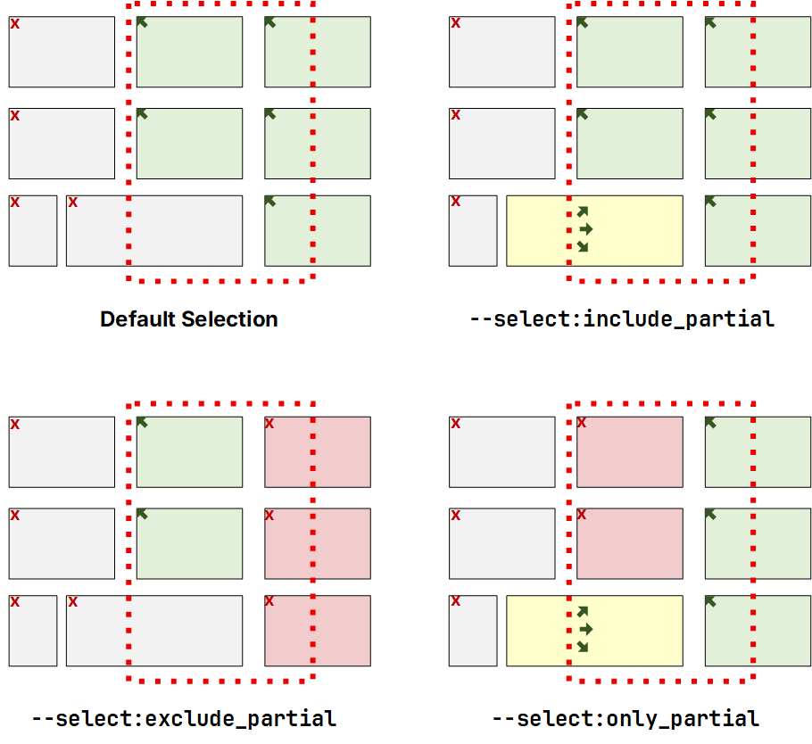

---

### Insert

Inserts empty whole or partial rows or columns by pushing tiles beyond the insertion point.

**Action:** `--insert:mode`

**Modes:** `rows` | `cols`

```
--insert:rows <count> <at_row>
--insert:cols <count> <at_col>
```

- **rows** — Pushes down (increase tile's `row` by `count`) tiles at/after `at_row`, and optionally tiles overlapping the insertion row.
- **cols** — Pushes right (increase tile's `col` by `count`) tiles at/after `at_col`, and optionally tiles overlapping the insertion column.

**Selection Modifiers:**

- `--col_range <start_col> <end_col>` — Insert rows only in column range. Only valid with `--insert:rows`.
- `--row_range <start_row> <end_row>` — Insert columns only in row range. Only valid with `--insert:cols`.
- `--select:include_partial` — Insert rows or columns before tiles whose span crosses over the insertion point row or column.

**Option:**

- `--confirm_keep` — Enables a confirmation prompt (independent of `--force`) after writing output, to keep or undo the changes.

> **Note:** `--select:exclude_partial` and `--select:only_partial` cannot be used with `--insert`.

**Examples:**

**1. Default Selection** — All tiles on or left of the insertion point column are selected. Tiles whose spans cross over the insertion point column are **not** selected.

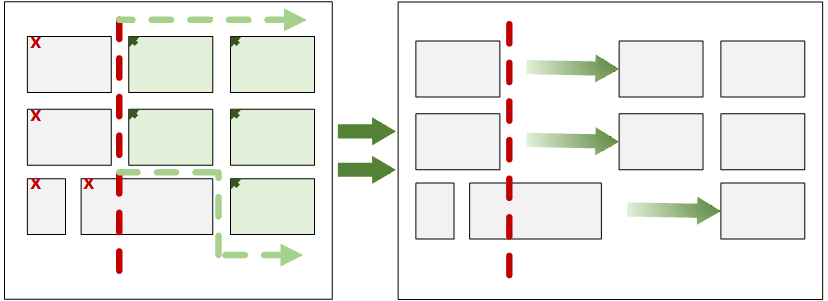

**2. `--select:include_partial`** — All tiles on or left of the insertion point column are selected. Tiles whose spans cross over the insertion point column **are** selected. Selected tiles are shifted by the number of inserted columns.

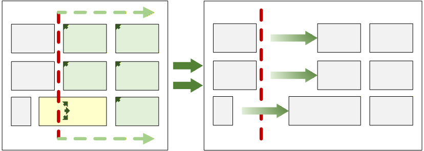

---

### Move

Moves tiles to a new location.

**Action:** `--move:mode`

**Modes:** `rows` | `cols` | `range`

```
--move:rows <start_row> <end_row> <dest_start_row>
--move:cols <start_col> <end_col> <dest_start_col>
--move:range <src_top_row> <src_left_col> <src_bottom_row> <src_right_col> <dest_top_row> <dest_left_col>
```

**Selection Modifiers:**

- `--select:include_partial`
- `--select:exclude_partial`

**Options:**

- `--overlaps:allow` — Ignore conflicts and allow moved tiles to overlap existing tiles at the destination.
- `--overlaps:skip` — Skip tiles that would conflict, move all others.
- `--confirm_keep` — Enables a confirmation prompt (independent of `--force`) after writing output, to keep or undo the changes.

**Notes:**

- Moving tiles does not alter the layout of other tiles. The space occupied by the moved tiles remains empty.
- Conflict detection is evaluated once, before moving, against existing tiles at the destination only.
- Tiles that are being moved can be overlapped and will not be considered in conflict.
- Actions will be aborted if conflicts are found unless `--overlaps:allow` or `--overlaps:skip` is present.

---

### Copy

Same as Move, but the originals remain. Copies are created with new IDs. Existing tile-specific CSS rules in `customCSS` can be optionally copied with the new IDs.

**Action:** `--copy:mode`

**Modes:** `rows` | `cols` | `range`

```
--copy:rows <start_row> <end_row> <dest_start_row>
--copy:cols <start_col> <end_col> <dest_start_col>
--copy:range <src_top_row> <src_left_col> <src_bottom_row> <src_right_col> <dest_top_row> <dest_left_col>
```

**Selection Modifiers:**

- `--select:include_partial`
- `--select:exclude_partial`

**Options:**

- `--overlaps:allow` — Ignore conflicts and allow copied tiles to overlap existing tiles at the destination.
- `--overlaps:skip` — Skip tiles that would conflict, copy all others.
- `--css:ignore` — Disables creating/copying CSS for new IDs.
- `--confirm_keep` — Enables a confirmation prompt (independent of `--force`) after writing output, to keep or undo the changes.

**Notes:**

- New tile-ids for the copied tiles are created sequentially, starting with:

  ```
  1 + max ( highest existing tile-ID, highest referenced tile-ID in customCSS )
  ```

  This prevents any orphaned CSS rules from being applied to new tiles.
- By default, tile-scoped CSS rules and comments that reference the tiles being copied will be duplicated and mapped to the new tile-ids.
- Conflict detection is evaluated once, before copying, against existing tiles at the destination only.
- Tiles that are being copied can be overlapped and will not be considered in conflict.
- Actions will be aborted if conflicts are found unless `--overlaps:allow` or `--overlaps:skip` is present.

---

### Merge

Merge (copy) tiles from another dashboard layout into this layout.

**Action:** `--merge:mode --merge_source:type <"filename | url">`

**Modes:** `rows` | `cols` | `range`

```
--merge:rows <start_row> <end_row> <dest_start_row>
--merge:cols <start_col> <end_col> <dest_start_col>
--merge:range <src_top_row> <src_left_col> <src_bottom_row> <src_right_col> <dest_top_row> <dest_left_col>
```

**Source Types (required):** `file` | `hub`

- `--merge_source:file <"filename">` — load dashboard JSON from file.
- `--merge_source:hub <"other_dashboard_local_url">` — fetch dashboard JSON directly from the hub.

**Selection Modifiers:**

- `--select:include_partial`
- `--select:exclude_partial`

**Options:**

- `--overlaps:allow` — Ignore conflicts and allow merged tiles to overlap existing tiles at the destination.
- `--overlaps:skip` — Skip tiles that would conflict, merge all others.
- `--css:ignore` — Disables creating/copying CSS for new IDs.
- `--confirm_keep` — Enables a confirmation prompt (independent of `--force`) after writing output, to keep or undo the changes.

**Notes:**

- New tile-ids for the merged tiles are created sequentially, starting with:

  ```
  1 + max ( highest existing tile-ID, highest referenced tile-ID in customCSS )
  ```

  This prevents any orphaned CSS rules from being applied to new tiles.
- By default, tile-scoped CSS rules and comments that reference the tiles being merged will be duplicated and mapped to the new tile-ids.
- Conflict detection is evaluated once, before merging, against existing tiles in the destination only.
- Tiles that are being merged can be overlapped and will not be considered in conflict.
- Actions will be aborted if conflicts are found unless `--overlaps:allow` or `--overlaps:skip` is present.

---

### Delete

Deletes tiles located in the target rows or columns, then shifts remaining tiles to close the gap.

**Action:** `--delete:mode`

**Modes:** `rows` | `cols`

```
--delete:rows <start_row> <end_row>
--delete:cols <start_col> <end_col>
```

**Selection Modifiers:**

- `--row_range <start_row> <end_row>` — Delete only rows in range from columns. Only valid with `--delete:cols`.
- `--col_range <start_col> <end_col>` — Delete only columns in column range from rows. Only valid with `--delete:rows`.
- `--select:include_partial` — Delete tiles whose span crosses over the starting row or column of the target area.

**Options:**

- `--overlaps:allow` — Allow tiles to be shifted over existing tiles when columns or rows are deleted.
- `--force` — Skip confirmation prompts (assumes yes).
- `--confirm_keep` — Enables a confirmation prompt (independent of `--force`) to keep or undo the changes.
- `--css:cleanup` — Remove tile-scoped CSS rules from `customCSS` for removed tiles.

**Notes:**

- The default behavior is to leave tile CSS rules for tiles removed or cleared by the current operation in place, unless `--css:cleanup` is present.
- Use `--scrub_css` to remove all orphaned CSS rules, including rules for tiles removed or cleared by the current operation.
- Use `--select:include_partial` to avoid conflicts that may occur when tiles are shifted after rows or columns are removed.

**Example:**

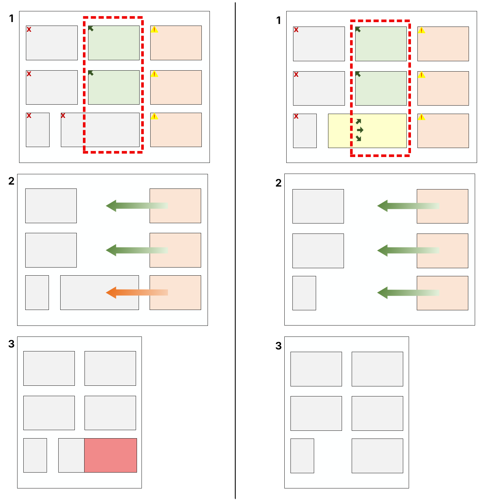

**Default Selection**

1. Only tiles located in the target area columns are selected.
2. Selected tiles are removed from the target area columns. The partial tile remains with part of its span remaining within the target area columns.
3. Target area columns are deleted by shifting tiles to the right of the target area columns left by the number of columns removed. This creates a conflict with the partial tile.

**`--select:include_partial`**

1. Tiles located in the target area columns or whose span extends into it are selected.
2. Selected tiles are removed leaving the target area empty.
3. Target area columns are deleted by shifting tiles to the right of the target area columns left by the number of columns removed. Since the target area columns were empty, there are no conflicts.

---

### Clear

Removes tiles in the target rows, columns or range but does not change the dashboard layout.

**Action:** `--clear:mode`

**Modes:** `rows` | `cols` | `range`

```
--clear:rows <start_row> <end_row>
--clear:cols <start_col> <end_col>
--clear:range <top_row> <left_col> <bottom_row> <right_col>
```

**Selection Modifiers:**

- `--select:include_partial`
- `--select:exclude_partial`
- `--select:only_partial`

**Options:**

- `--force` — Skip confirmation prompts (assumes yes).
- `--confirm_keep` — Enables a confirmation prompt (independent of `--force`) after writing output, to keep or undo the changes.
- `--css:cleanup` — Remove tile-scoped CSS rules from `customCSS` for tiles removed or cleared by the current action.

**Notes:**

- The default behavior is to leave tile CSS rules for tiles removed or cleared by the current operation in place, unless `--css:cleanup` is present.
- Use `--scrub_css` to remove all orphaned CSS rules, including rules for tiles removed or cleared by the current operation.

**Examples:** *(Selected tiles are removed leaving empty spaces.)*

**1. Default Selection** — Only tiles located on or within the target area are selected.

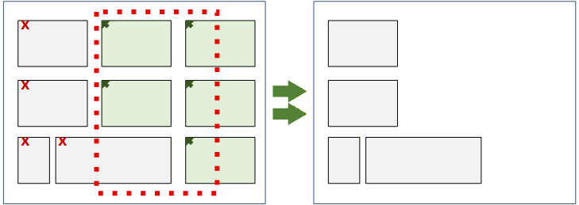

**2. `--select:include_partial`** — Tiles having any part on or within the target area are selected.

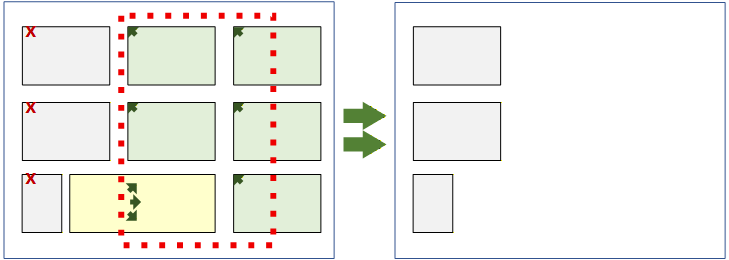

**3. `--select:exclude_partial`** — Only tiles that are fully contained on or within the target area borders are selected.

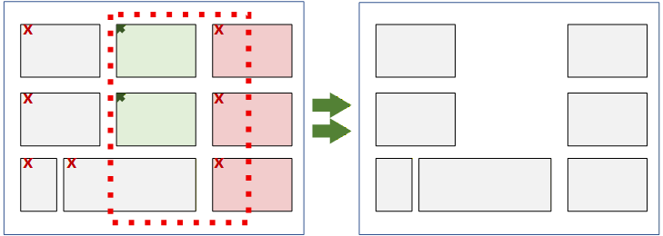

**4. `--select:only_partial`** — Only tiles whose span crosses over a border of the target area are selected.

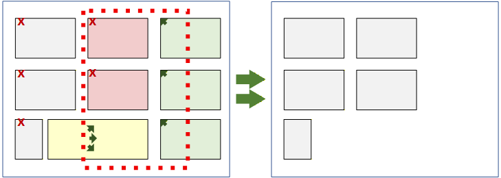

---

### Crop

Clears all tiles located outside of the target rows, columns or range. The position of remaining tiles is unchanged.

**Action:** `--crop:mode`

**Modes:** `rows` | `cols` | `range`

```
--crop:rows <start_row> <end_row>
--crop:cols <start_col> <end_col>
--crop:range <top_row> <left_col> <bottom_row> <right_col>
```

**Selection Modifiers:**

- `--select:include_partial` — Keep tiles that are located (begin) outside of the target area but cross into it.
- `--select:exclude_partial` — Only keep tiles whose span is fully contained within the target area.

**Options:**

- `--force` — Skip confirmation prompts (assumes yes).
- `--confirm_keep` — Enables a confirmation prompt (independent of `--force`) after writing output, to keep or undo the changes.
- `--css:cleanup` — Remove tile-scoped CSS rules from `customCSS` for tiles removed or cleared by the current action.

**Notes:**

- The default behavior is to leave tile CSS rules for tiles removed or cleared by the current operation in place, unless `--css:cleanup` is present.
- Use `--scrub_css` to remove all orphaned CSS rules, including rules for tiles removed or cleared by the current operation.
- At least one tile must remain after cropping.
- Crop only removes tiles but does not change the position of the remaining tiles. Use `--trim`, `--trim:top` or `--trim:left` to remove blank rows and columns above or left of the remaining tiles.

**Examples:** *(All unselected tiles are removed leaving empty spaces.)*

**1. Default Selection** — Only tiles located on or within the target area are selected.

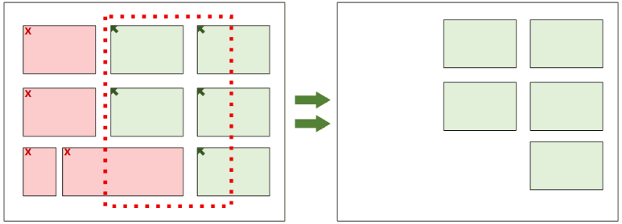

**2. `--select:include_partial`** — Tiles having any part on or within the target area are selected.

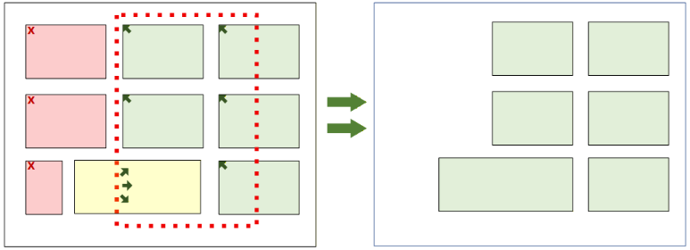

**3. `--select:exclude_partial`** — Only tiles that are fully contained on or within the target area borders are selected.

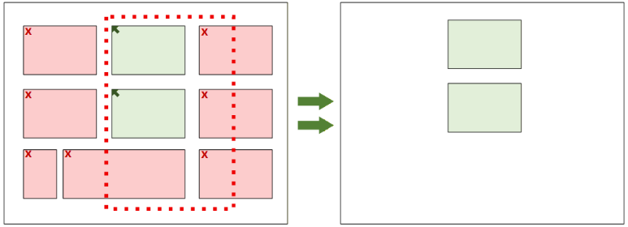

---

### Prune

Clears tiles based on a list of either tile-id numbers or device-id numbers. `--prune` removes only those tiles listed, while `--prune_except` removes all tiles except those tiles listed. Pruned tiles are cleared. No changes are made to the layout of the remaining tiles.

**Actions:** `--prune:mode` / `--prune_except:mode`

**Modes:** `ids` | `devices`

```
--prune:ids <list>
--prune:devices <list>
--prune_except:ids <list>
--prune_except:devices <list>
```

**Acceptable list Values:**

- Explicit values: `1,4,6,8,9`
- Comparisons: `<29`
- Inclusive ranges: `3-20,40-58`
- Combination: `<29,43,46,>=100`

**Options:**

- `--force` — Skip confirmation prompts (assumes yes).
- `--confirm_keep` — Enables a confirmation prompt (independent of `--force`) after writing output, to keep or undo the changes.
- `--css:cleanup` — Remove tile-scoped CSS rules from `customCSS` for tiles removed or cleared by the current action.

**Notes:**

- If `--css:cleanup` is not present, tile-scoped custom CSS rules referencing removed or cleared tiles will be left in place.
- Use `--scrub_css` to remove all orphaned CSS rules, including rules for tiles removed or cleared by the current operation.
- At least one tile must remain after pruning.
- Use `--trim`, `--trim:top` or `--trim:left` to remove blank rows on the top or columns on the left of the remaining tiles.

---

### Spacing

Increases, decreases or sets uniform spacing between all dashboard tiles.

**Actions:** `--spacing_add:mode` / `--spacing_set:mode`

- **Add** — Increase or decrease space between tiles by adding empty cells to rows and/or columns between tiles. Use a positive number to increase the existing spacing by the number of cells, or a negative number to decrease existing spacing.
- **Set** — Sets the spacing uniformly around all tiles to the number of cells. Values cannot be less than zero.

**Modes:** `rows` | `cols` | `all`

```
--spacing_add:rows [-]<# of cells>
--spacing_add:cols [-]<# of cells>
--spacing_add:all  [-]<# of cells>
--spacing_set:rows <# of cells>
--spacing_set:cols <# of cells>
--spacing_set:all  <# of cells>
```

**Options:**

- `--overlaps:remove_all` — only valid with `--spacing_set`. This option will distribute all overlapping tiles into the layout. Depending on the number of overlapping tiles, moving overlapping tiles into the layout may result in significant changes to the position of other tiles.
- `--overlaps:remove_partial` — only valid with `--spacing_set`. This option will distribute partially overlapping tiles into the layout. Spacing between fully nested tiles is not changed. Depending on the number of overlapping tiles, moving overlapping tiles into the layout may result in significant changes to the position of other tiles.
- `--confirm_keep` — Enables a confirmation prompt (independent of `--force`) after writing output, to keep or undo the changes.

**Examples:**

**Original Layout**

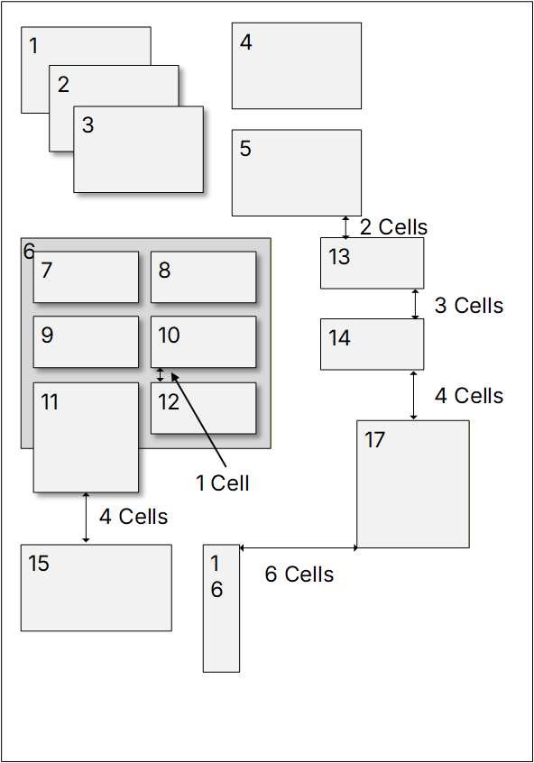

**`--spacing_add:all 1`**

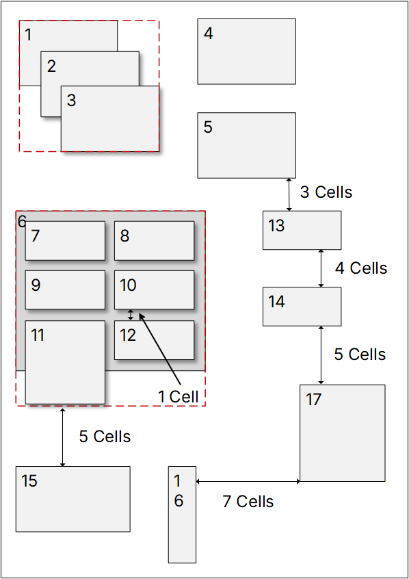

**`--spacing_set:all 0 --overlaps:remove_partial`**

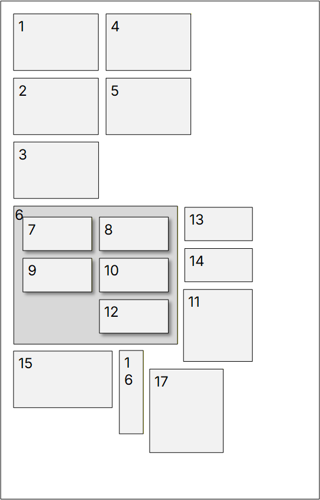

**`--spacing_set:all 0 --overlaps:remove_all`**

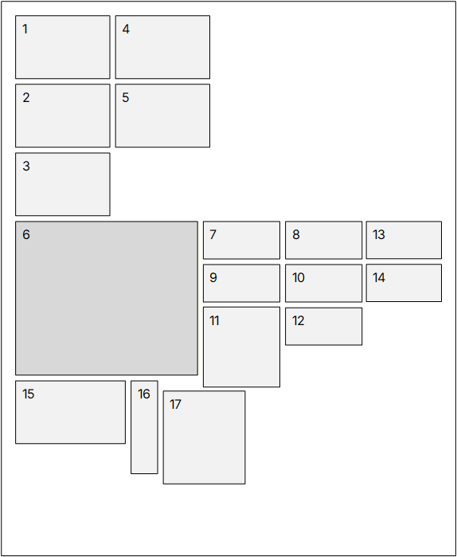

**Notes:**

- **Overlapping Tiles:**
  - Overlapping tiles are treated as a single tile. The span of the grouped tile is the farthest left and highest top edge to the farthest right edge and lowest bottom edge of the tiles in the group.
  - **Nested tiles** are overlapping tiles whose span is fully contained within the span of a tile it overlaps. Nested tiles can overlap other nested tiles. Spacing changes are never applied to nested tiles within a container tile unless `--overlaps:remove_all` is present.
  - **Container tiles** are the largest tile that fully surround one or more nested tiles. Container tiles can overlap other tiles. They are treated the same as regular tiles when changing layout spacing.
- Tiles do not need to be uniformly sized or in straight columns or rows. However, applying uniform spacing to complex layouts with wide differences in tile sizes can lead to unpredictable outcomes.
- Spacing between tiles will never be reduced below zero.
- `--overlaps:remove_partial` and `--overlaps:remove_all` spread out overlapping tiles while keeping as much of the original tile order and general layout as possible. Overlapping and nested tiles may cause unpredictable layout changes, especially when working with large or complex layouts.
- `--overlaps:remove_all` can be used to rapidly add tiles to a dashboard. Tiles can be added haphazardly or stacked in the same location, then laid out uniformly with `--spacing_set` and this switch.

---

### Trim

Removes blank rows above the top-most tile and/or blank columns left of the left-most tile.

**Action:** `--trim:mode`

**Modes:** `top` | `left` | `(top,left)`

```
--trim                 (defaults to top,left)
--trim:top
--trim:left
--trim:top,left        (or --trim:left,top)
```

**Option:**

- `--confirm_keep` — Enables a confirmation prompt (independent of `--force`) after writing output, to keep or undo the changes.

**Example:**

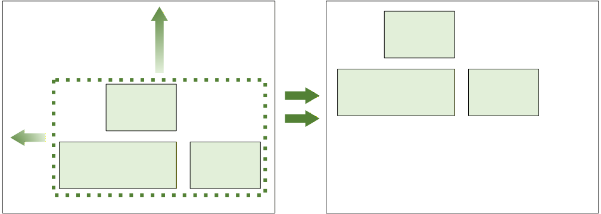

- Trim removes empty rows up to the top of the upper most tile, and columns up to the left most tile. The entire layout is shifted with all other spacing preserved.

**Notes:**

- The trim action can be used in conjunction with another action, or as a standalone action.
- When combined with another action, trimming will only occur after successful completion of the primary action.

<div align="right"><a href="#table-of-contents">↑ Back to top</a></div>

---

## CSS Actions and Options

### Copy CSS

Copies CSS rules from one tile to another.

**Action:** `--copy_css:mode`

**Modes:** `merge` | `replace` | `overwrite` | `add`

```
--copy_css:merge     <from_tile-id> <to_tile-id>
--copy_css:replace   <from_tile-id> <to_tile-id>
--copy_css:overwrite <from_tile-id> <to_tile-id>
--copy_css:add       <from_tile-id> <to_tile-id>
```

- **Merge** — Copies rules checking for conflicts with existing rules. Conflicts generate a user prompt to overwrite or keep (default) existing rules. The default action is to preserve the existing rule.
- **Replace** — Removes all rules from the destination tile and replaces them with the rules being copied. A confirmation prompt is generated before proceeding. The default action is to proceed.
- **Overwrite** — Copies rules checking for conflicts with existing rules. Conflicts generate a user prompt to overwrite (default) or keep existing rules. The default action is to overwrite the existing rule.
- **Add** — Copies all rules to the target tile, regardless of any potential conflicts. Conflicts generate a user prompt to confirm adding (default) or skipping conflicting rules. The default action is to keep both rules.

**Option:**

- `--force` — Skip confirmation prompts and select the default response.

**Notes:**

- All modes generate a confirmation prompt if `--force` is not present.
- Rule conflicts are rules having the same scope and declarations.

**Examples:**

- **Contains conflicts** (same scope, overlapping declarations):

  ```css
  #tile-123 { color: red; padding: 5px; }
  #tile-141 { margin: 2px; padding: 3px; }
  ```

- **Not a conflict** (no overlapping declarations):

  ```css
  #tile-123 { background-color: blue; color: red; }
  #tile-141 { margin: 2px; padding: 5px; }
  ```

- When used with `--force`, merge, overwrite and add differ only in the default action taken.

---

### Clear CSS

Removes CSS rules in `customCSS` with selectors referencing a tile-id.

**Action:** `--clear_css <"list">`

**Acceptable tile-id list Values:**

- Explicit values: `1,4,6,8,9`
- Comparisons: `<29`
- Inclusive ranges: `3-20,40-58`
- Combination: `<29,43,46,>=100`

**Option:**

- `--force` — Skip confirmation prompts (assumes yes).

**Notes:**

- Only CSS rules for existing tiles can be cleared.
- Orphaned rules can only be removed with the `--scrub_css` action.

---

### Scrub CSS

Removes all tile-scoped CSS rules from `customCSS` with selectors that reference tiles that are no longer in the current dashboard layout.

**Action:** `--scrub_css`

**Option:**

- `--force` — Skip confirmation prompts (assumes yes).

**Notes:**

- May be used as a standalone primary action or as a supplemental action after the primary action has completed successfully.
- See [CSS Overview](#css-overview) for more information.

---

### Compact CSS

**Overview:**

- Reformats `customCSS` in a compact, sortable and more easily parsed format.
- Selector rules are output as one line each.
- Rule bodies are condensed to one line (whitespace compacted; strings/comments preserved as text).
- Selector lists are split to separate rules per selector.

**Example CSS:**

```css
#tile-4, #tile-123 { ... }
```

→

```css
#tile-4 { ... }
#tile-123 { ... }
```

**Rules are sorted in groups:**

1. Root Tags, not tile-ids, etc.
2. Non tile class selectors starting with `.` excluding `.tile-id`.
3. Tile class selectors (`#tile-id`, `.tile-id`) ordered by tile-id.
4. Commented out rules and comments with tile references (`#tile-id`, `.tile-id`) are sorted with other tile selectors.
5. Comments that do not contain specific tile references are sorted into group 1.

**Action:** `--compact_css`

**Notes:**

- CSS reformatting is performed last, after all other operations have completed. It can be used as a standalone primary action or as a supplemental action.
- See [CSS Overview](#css-overview) for more information.

<div align="right"><a href="#table-of-contents">↑ Back to top</a></div>

---

## Supplemental Actions and Options

### Sort (JSON Only)

Changes the order tiles appear in the dashboard layout JSON only.

**Action:** `--sort_json ["spec"]`

**Spec Keys:** `i` | `-i` | `r` | `-r` | `c` | `-c`

| Key | Meaning |
|-----|---------|
| `[-]i` | tile-ID |
| `[-]r` | row |
| `[-]c` | column |

**Notes:**

- Sorting only changes the order tiles are listed in the dashboard JSON. It is mostly for cosmetic and readability purposes. It has no effect on the layout.
- By default, actions do not change the order tiles are listed in the layout JSON unless `--sort_json` is present.
- The default sort order, `i` (tile-ID) in ascending order, will be applied if no sort key is specified.
- Tile-IDs should be unique and therefore must always be the last sort key.
- ID will be automatically appended as the last sort key if not already explicitly stated.
- Keys are sorted in ascending order unless preceded by a `-`.
- Ascending or descending order can be specified for each key. Examples: `--sort_json "rc-i"` or `--sort_json "-r-ci"`.

---

### Visual Layout Maps

Show before, outcome and conflict layout previews in the terminal.

**Action:** `--show_map:mode`

**Modes:** `full` | `no_scale` | `conflicts`

```
--show_map:full
--show_map:no_scale
--show_map:conflicts
```

- **Full** — Maps show the full dashboard, scaled to fit the terminal. Scaling is limited and may still require a larger terminal window for proper display.
- **No Scale** — Show the full layout without scaling. Each row and column are represented by one character space. Depending on terminal size, large layouts may not display properly.
- **Conflicts** — Zoomed to show only tiles in conflict without scaling. All other maps are full layout with scaling.

**Options:**

- `--show_ids` — Displays tile-ids on maps.
- `--show_axis:mode` — Display row and/or column numbers on axes.

  **Modes:** `row` | `col` | `all`

  ```
  --show_axis:row
  --show_axis:col
  --show_axis:all
  ```

> **Note:** When using `--show_ids`, it may not be possible to fit all tile-ids within the space available. If necessary, small or overlapping tiles will be labeled with a group letter instead of their tile-id. The contents of each group will be listed below the map.

**Examples:**

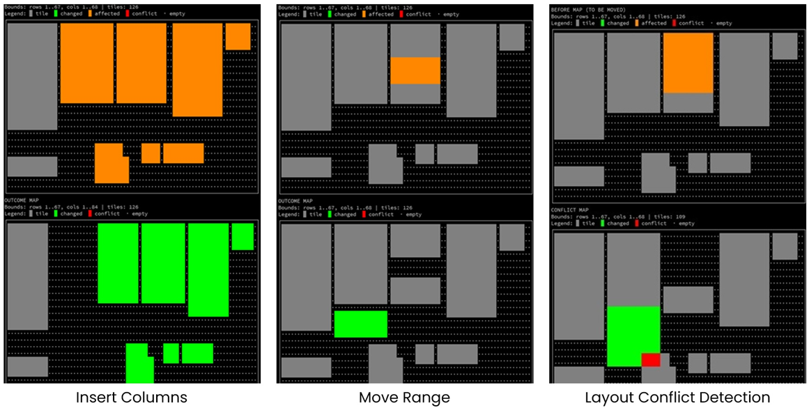

**Map Legend:**

| Color | Meaning |
|-------|---------|
| ⚪ gray dot | empty spaces |
| ⬜ gray | unaffected tiles |
| 🟧 orange | tiles in the target row, column or range before changes are made |
| 🟩 green | tiles successfully changed by the action or portions not in conflict |
| 🟥 red | tiles (or portions) in conflict that caused the action to fail |
| 🟨 yellow | tiles (or portions) in conflict allowed by `--overlaps:allow` |

---

### Dashboard Tile Lists

Generate lists of dashboard tiles and basic attributes.

**Action:** `--list_tiles:mode ["sort"]`

**Modes:** `plain` | `tree` | `overlap` | `nested` | `conflicts`

```
--list_tiles:plain     ["sort"]
--list_tiles:tree      ["sort"]
--list_tiles:overlap   ["sort"]
--list_tiles:nested    ["sort"]
--list_tiles:conflicts ["sort"]
```

- **Plain** — Lists all tiles in sort order with attributes in columns.
- **Tree** — Lists all tiles in a hierarchical tree to reflect standalone, overlapping and nested tiles. This is best used with complex layouts with intentionally layered tiles.
- **Overlap** — Lists tiles which partially overlap other tiles.
- **Nested** — Lists tiles which are nested (the entire tile overlaps another) inside another tile.
- **Conflicts** — List all tiles with the same location origin (upper left corner), overlapped, potential duplicates, CSS rule conflicts, etc.

**Sort Keys:** `i` | `-i` | `r` | `-r` | `c` | `-c`

| Key | Meaning | Key | Meaning |
|-----|---------|-----|---------|
| `[-]i` | id | `[-]p` | placement\* |
| `[-]r` | row | `[-]d` | device\* |
| `[-]c` | column | `[-]t` | template\* |
| `[-]h` | height\* | `[-]s` | css rules\* |
| `[-]w` | width\* | | |

- The default sort order, `i` (tile-ID) in ascending order, will be applied if no sort key is specified.
- Tile-IDs should be unique and therefore must always be the last sort key.
- ID will be automatically appended as the last sort key if not already explicitly stated.
- The default sort order for keys is ascending unless preceded by a `-`.
- \* Plain list format only.

**Examples:**

- `--list_tiles:plain "drc-pi"` — List in plain format, sort by device, row, column, placement (descending), id.
- `--list_tiles:nested "r-c"` — List nested tiles, sort by row, column (descending), id.

**Plain List Fields:**

- **Tile-ID**
- **Row, Col** (Location of upper left corner)
- **Height, Width** (# of rows, columns that make up the tile's span)
- **Placement**
  - **Independent** — Standalone tile. Tile is not overlapping or nesting and does not touch any other tile. If dashboard tiles are laid out without space between them, then all non-overlapping tiles are considered independent.
  - **Cluster** — Tile touches one or more other tiles (does not overlap) and where the union of those tiles form a distinct group, with empty space around it. If all dashboard tiles are laid out without space between them, all tiles are considered independent.
  - **Nested** — Tile is an overlapping tile whose span is completely contained within the span of another tile.
  - **Overlapping** — Tile's span is partially overlapped by another tile.
  - **Container** — Tile that contains nested tiles but is not nested within any other tile.
- **Device**
- **Template**
- **CSS Rules** — Number of rules or comments found in `customCSS` referencing that tile-id.

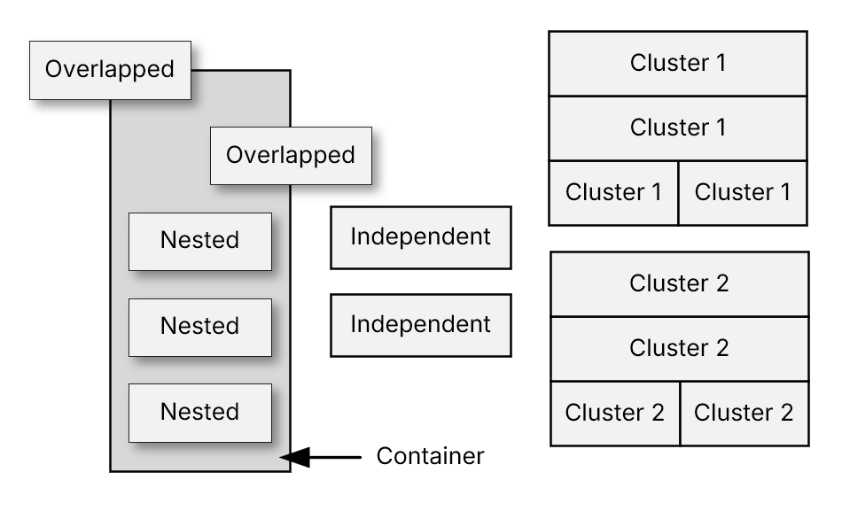

**Notes:**

- `--list_tiles` is a standalone action that cannot be combined with any other operations.
- Use `--output` destination to save listings. `--output:hub` is not valid.
- If no `--output` destination is specified, output will default to the terminal.
- In conflict lists, tiles with shared origins are overlapping tiles that begin at the same upper left corner location.

---

### Miscellaneous Options

**Prompts / Confirmation Options:**

- `--force` — Suppress confirmation prompts for actions which remove tiles or custom CSS rules.
- `--confirm_keep` — Enables a confirmation prompt (independent of `--force`) after writing output, to keep or undo the changes.

**Safety / Undo Options:**

- `--lock_backup` — Retains the last undo backup (if found) as the undo backup for the current action.
- `--undo_last` — Loads the undo backup (if found) and writes it to the previous action's output destination.

**Notes:**

- `--undo_last` may be used with `--output:<type>` to override where the undo will be restored to. However, the restore destination type must match the specified output type. For example, if the last output was a file, the restore destination must also be a file. A new filename can be specified if desired.
- Backup files contain the JSON imported before an action is performed. The backup file is not created until after the action completes, and the result has been successfully saved to the output destination.
- When restoring directly to the hub, there are additional safeguards in place to prevent:
  - Restoring and overwriting a different dashboard than the dashboard layout in the undo file (a different `--output:hub <local dashboard url>` is specified with the `--undo_last` action).
  - Restoring an older backup than intended (Undo is older than 5 minutes).
  - Edits made to a dashboard after the backup was created (The current dashboard layout stored on the hub does not match the layout that was uploaded last).
- A confirmation prompt will be presented if any of the safeguards are triggered. Use `--force` to suppress prompts.
- The purpose of `--confirm_keep` is to provide an opportunity to review or test the outcome of an action, then if necessary, undo it. This is useful when tweaking action target ranges or options. It is the same as running an action without `--confirm_keep`, then using the `--undo_last` action.

**Output / Debug Information Options:**

- `--quiet` — suppress end-of-run summary line (errors still shown).
- `--verbose` — planned actions + concise results.
- `--debug` — per-tile action logs + deep details.

**Help:**

- `-h`, `--help` — Short help.
- `--help:full` — Full detailed help.

<div align="right"><a href="#table-of-contents">↑ Back to top</a></div>

---

## Custom CSS Handling — Capabilities & Limits

### CSS Overview

- When tiles are copied/merged (new tile-IDs are created) or removed (delete/clear/crop/prune), the tool can optionally update `customCSS` by:
  - duplicating tile-scoped rules for the new tile-IDs
  - removing tile-scoped rules for removed tile-IDs (`--css:cleanup`)
  - scrubbing orphaned tile-scoped rules (`--scrub_css`)
- CSS parsing is limited to typical Hubitat dashboard CSS, not full CSS grammar. Specifically, the parser can only "see" and process "tile-scoped" rules and has limited support for rules inside of comment blocks.
- Inconsistent formatting, line breaks and whitespace may interfere with CSS parsing.

### CSS Rule Guidelines

- A rule is treated as tile-scoped when its **selector** (the part before `{...}`) contains a tile-identifier such as `#tile-123` or `.tile-123`.
- Declarations do not define ownership. Tile-like text inside the declaration block (`{ property: value; }`) is not enough to associate a rule with a tile unless the selector also scopes the rule to that tile.
- Rules inside `@media { ... }` blocks can be duplicated/removed, but the tool does not attempt to fully normalize complex nested at-rules.
- Use `--css:ignore` if your `customCSS` contains advanced selector patterns or complicated blocks you do not want rewritten.
- Avoid using `--copy_css`, `--css:cleanup` and `--scrub_css` on dashboards with CSS that intentionally cross-references multiple tiles in a single selector item.

---

### Compatible Selector Patterns

#### ✅ Single selector item scoped to one tile

**Example CSS:**

```css
#tile-123 { <declarations> }
.tile-123 { <declarations> }
#tile-123 .icon { <declarations> }
```

💡 **Copy/merge behavior** (copy 123 → 141): Rules for copied tiles are unchanged, and selectors are duplicated and remapped to new tiles.

```css
/* unchanged */
#tile-123 { <declarations> }
.tile-123 { <declarations> }
#tile-123 .icon { <declarations> }

/* duplicated + remapped */
#tile-141 { <declarations> }
.tile-141 { <declarations> }
#tile-141 .icon { <declarations> }
```

💡 **When removing tile 123:** all matching rules are removed.

```css
#tile-123 { <declarations> }   /* removed */
.tile-123 { <declarations> }   /* removed */
#tile-123 .icon { <declarations> }   /* removed */
```

#### ⚠️ Selector list (comma-separated) containing tile selectors

> Acceptable, but not preferred. For best results, use separate single selector rules.

**Example CSS:**

```css
#tile-4, #tile-20, #tile-123 { <declarations> }
```

💡 **Copy/merge behavior** (copy 123 → 141): The original rule remains unchanged. A new, single-selector rule is created for the new tile.

```css
#tile-4, #tile-20, #tile-123 { <declarations> }   /* unchanged */
#tile-141 { <declarations> }                       /* new */
```

💡 **Removal behavior** (remove tile 123): Only the selector item matching the removed tile is removed. If the selector list becomes empty, the whole rule is removed.

```css
#tile-4, #tile-20 { <declarations> }
```

#### ✅ Rules inside `@media` blocks

**Example CSS:**

```css
@media (max-width: 600px) {
  #tile-50 { <declarations> }
  #tile-123 { <declarations> }
}
```

💡 **Copy/merge behavior** (copy 123 → 141): A new, single-selector rule is created for the new tile and placed inside the `@media` block.

```css
@media (max-width: 600px) {
  #tile-50 { <declarations> }
  #tile-123 { <declarations> }
  #tile-141 { <declarations> }
}
```

💡 **Removal behavior** (remove tile 123): Only the selector item matching the removed tile is removed. If the selector list becomes empty, the whole rule is removed. The `@media` block will **not** be removed, even if all rules are removed.

```css
@media (max-width: 600px) {
  #tile-50 { <declarations> }
}
```

---

### Incompatible and Problematic CSS Rules

#### ❌ Multi-Tile Selector Items

Avoid selector patterns where one selector item references multiple tiles at once. They are problematic because when copying one tile (e.g., 123 → 141), the tool would have to guess what to do with the other tile-IDs in the same selector item — often producing hybrid selectors that look meaningful but match nothing. These should not be confused with selector lists.

**Examples:**

- ⚠️ **Selector Lists** — compatible but not bulletproof. For best results, use separate single selector rules.

  ```css
  #tile-4, #tile-20, #tile-123 { ... }
  ```

- ❌ **Compound Selectors with multiple tile-ids** — avoid selectors requiring one element to have both classes at the same time. Hubitat tile containers typically represent one tile-ID, so the duplicate selector is usually "dead CSS."

  ```css
  .tile-80.tile-123 { ... }
  ```

- ❌ **Child Combinator with multiple tile-IDs** — avoid selectors where one tile is a direct child of another. Hubitat tiles are normally siblings in the grid, not nested.

  ```css
  .tile-80 > .tile-123 { ... }
  ```

- ❌ **Descendant Combinator with multiple tile-ids** — avoid nested selectors, or chains of multiple tile-IDs. Hubitat dashboard tiles are normally siblings in a grid (not nested tiles).

  ```css
  #tile-80 #tile-123 .icon { ... }
  ```

- ❌ **Rules with no tile-scoping selector** — these rules are not associated with a specific tile-ID, so they are not duplicated/removed by tile-ID operations.

  ```css
  .some-class::after { content: "..." }
  .tile .tile-content { padding: 0; }
  ```

#### 🟠 Tile-IDs inside declaration blocks

Tile references within the declaration block are remapped **if** the tile references match the selector's tile. All other rules are duplicated verbatim.

**Example 1 — Tile reference matches the selector and is remapped in the duplicated rule:**

```css
/* original */
#tile-123 .tile-content { background-image: url("/images/tile-123.png"); }
```

💡 Copy 123 → 141:

```css
#tile-123 .tile-content { background-image: url("/images/tile-123.png"); }
#tile-141 .tile-content { background-image: url("/images/tile-141.png"); }
```

**Example 2 — Tile reference does *not* match the selector and is duplicated verbatim:**

```css
/* original */
#tile-123 .tile-content { background-image: url("/images/tile-999.png"); }
```

💡 Copy 123 → 141:

```css
#tile-123 .tile-content { background-image: url("/images/tile-999.png"); }
#tile-141 .tile-content { background-image: url("/images/tile-999.png"); }
```

---

### CSS Comments

Comment blocks within CSS can be problematic and complicate parsing and be difficult to manage when rules are added or removed.

#### Comment Block Duplication — Copy/Merge Operations

**Standalone (statement-level) comments:**

- Appear in their own CSS statement, including:
  - top-level in the stylesheet.
  - inside an `@media { ... }` block, but not inside any rule `{ ... }` declaration body.
  - rules which follow top-level rules and are outside of any rule `{ ... }` declaration body.
- A standalone comment is duplicated only if:
  - it references a tile-ID being duplicated (e.g., `tile-123`).
  - the destination tile-ID will also receive at least one duplicated real selector rule.
  - the comment references no more than one tile-ID.
- If those conditions are met, the comment is duplicated once per OLD → NEW, its tile-id text is remapped, and it is annotated.

**Example CSS:**

```css
/* tile-123 note */
```

💡 Copy 123 → 141:

```css
/* tile-141 note [dashboard_tile_utility] duplicated tile-123 to tile-141 */
```

**Rule-body comments:**

- Appear inside a selector block's declaration body.
- A rule body comment is copied automatically as part of the duplicated rule (because rule body text is always duplicated).

**Example CSS:**

```css
#tile-123 {
  /* inside the rule body */
  color: red;
}
```

💡 Copy 123 → 141 (the comment block is copied with the rule body):

```css
#tile-141 {
  /* inside the rule body */
  color: red;
}
```

**Selector-prelude comments:**

- Appear embedded in the selector text itself.
- Comments are only copied if they are part of the selector being copied.

**Example CSS:**

```css
#tile-4 /* cmnt 1 */, /* cmnt 2 */ #tile-123 /* cmnt 3 */, #tile-5 { ... }
```

💡 Copy 123 → 141 (all of the content between the commas is considered part of the same selector and duplicated):

```css
#tile-4 /* cmnt 1 */, /* cmnt 2 */ #tile-123 /* cmnt 3 */, #tile-5 { ... }
/* cmnt 2 */ #tile-141 /* cmnt 3 */ { ... }
```

#### Rules inside comment blocks / commented out rules

- If target tile-ids are found in a comment block, the block is parsed to determine if the comment contains valid CSS rules with a selector matching the target tile-id.
- If no valid rules are located, the comment block is treated as a standard standalone comment.
- If one or more valid rules are found in the comment block with selectors containing the target tile-id:
  - Rules with selectors that contain the target tile-id are extracted.
  - Extracted rules are processed as normal CSS rules.
  - When copying or merging tiles, the duplicated CSS will be placed back inside comment delimiters.
  - The duplicated comment block will only contain the individual duplicated rules. All other content in the original comment block is ignored.
- If valid rules are located, but none have selectors which contain the target tile-id, the comment block will be treated as a standard standalone comment.

**Examples:**

*Comments in separate blocks* — each comment block is duplicated and remapped individually:

```css
/* a note about tile-123 */
/* #tile-123 { ... } */
```

💡 Copy 123 → 141:

```css
/* a note about tile-123 */
/* #tile-123 { ... } */
/* a note about tile-141 */
/* #tile-141 { ... } */
```

*Comments in the same block* — only the rule with the matching tile selector is extracted and duplicated; all other content in the block is ignored, and the extracted rule is placed in a new comment block:

```css
/* a note about tile-123
   #tile-123 { ... }
   #tile-621 { ... } */
```

💡 Copy 123 → 141:

```css
/* #tile-123 { ... } */
/* #tile-141 { ... } */
```

#### Comment Block Removal — Delete/Clear/Crop/Prune/CSS Clean-up Operations

- When tiles are removed and `--css:cleanup` is present during delete, clear, crop, and prune actions, or when CSS rules are removed during `--clear_css` or `--scrub_css` operations:
  - The tool removes tile-scoped selector rules for the removed tile-IDs.
  - If there are standalone comments referencing removed tile-IDs, the tool prompts (unless `--force`).
  - If comments are kept after rules are removed, the tool:
    - Inserts a comment that the tile/rules were removed.
    - Rewrites tile-id tokens to neutralized forms.

**Example:**

```css
/* styles for #tile-123 */
```

💡 `#tile-123` → `#tile_123`

The neutralized tokens (`tile_123`, `#tile_123`, `.tile_123`) are intentionally **not** valid selectors for the real tile. They exist to make it obvious the comment is historical and to prevent confusion during later review.

```css
/* [dashboard_tile_utility] tile(s) removed; CSS rules removed for: tile_123 */
```

<div align="right"><a href="#table-of-contents">↑ Back to top</a></div>

---

## Usage Examples

💡 **Insert 2 columns at col 15 (only in rows 4–32):**

```bash
python dtu.py --insert:cols 2 15 --row_range 4 32
```

💡 **Move columns 1–14 to start at 85 and save back to hub. Show the layout before and after maps without scaling:**

```bash
python dtu.py --import:hub <"dashboard_local_url"> --move:cols 1 14 85 --output:hub --show_map:no_scale
```

💡 **Copy tiles in the rectangular range 1,1 to 20,20 to a new location at 40,40:**

```bash
python dtu.py --copy:range 1 1 20 20 40 40
```

💡 **Crop to a range (delete everything outside), show full map, force, cleanup CSS, save to a file:**

```bash
python dtu.py --crop:range 1 1 85 85 --show_map:full --force --css:cleanup --output:file <"filename.json">
```

💡 **Remove orphan CSS rules only (no tile edits) without confirmation prompt:**

```bash
python dtu.py --scrub_css --force
```

💡 **Undo last run (restore last import to last outputs unless overridden):**

```bash
python dtu.py --undo_last
```

<div align="right"><a href="#table-of-contents">↑ Back to top</a></div>

---

## Batch Actions

**Tips for running batched or consecutive actions:**

- Use `--lock_backup` on all actions except the first action. This provides an undo from before any actions in the batch were run.
- Reduce risk and increase speed by minimizing using the clipboard to read and write intermediate layouts in batches.

### Example Batch

**Overview:**

1. Get the dashboard layout from the hub and insert 5 empty columns at column 10.
2. Merge (copy) columns 15–20 from another dashboard into columns 10–15 of this dashboard.
3. Crop the resulting layout keeping only tiles in the rectangular region 10,10 – 40,30.
4. Trim empty rows left behind at the top and left sides.
5. Cleanup orphaned CSS rules and output the final layout back to the hub.

**Commands:**

```bash
python dtu.py --import:hub <"dashboard_local_url"> --output:clipboard \
  --insert:cols 5 10

python dtu.py --import:clipboard --output:clipboard --merge_source:hub <"other_dashboard_url"> \
  --merge:cols 15 20 10 --lock_backup

python dtu.py --import:clipboard --output:hub <"dashboard_local_url"> \
  --crop:range 10 10 40 30 --select:include_partial --force --css:cleanup --trim --lock_backup
```

### Batched Actions in Detail

**The first action (run): `--insert:cols`**

1. Imports a layout from the hub.
2. Inserts 5 blank columns at column 10 in the layout.
3. Writes the new layout to the clipboard.
4. Saves the original imported layout to the undo backup file. In the event of an error, running `--undo_last` would not be necessary to undo any actions performed by the batch as they have only been saved to the clipboard. The original layout still exists unchanged on the hub.

**The second action: `--merge:cols`**

1. Imports the layout saved by the first action from the clipboard.
2. Copies tiles in columns 15–20 from another dashboard into the blank columns created by the previous action at column 10.
3. Writes the new layout to the clipboard.
4. Does not change the undo backup created by the first action. In the event of an error, running `--undo_last` would not be necessary to undo any actions performed by the batch as they have only been saved to the clipboard. The original layout still exists unchanged on the hub.

**The third action: `--crop:range` → `--trim:top,left` → `--css:cleanup`**

1. Imports the layout saved by the second action from the clipboard.
2. Removes all dashboard tiles except those located or having some portion inside the rectangular range of (row 10, col 10) to (row 40, col 30).
3. Bypasses tile removal confirmation prompt.
4. Removes any tile-specific CSS rules from `customCSS` for the tiles that were removed.
5. Bypasses CSS rule removal confirmation prompt.
6. Trims blank columns and rows from the top and left sides to move the layout of the remaining tiles as far to the upper left as possible.
7. Writes the final new layout to the hub.
8. Does not change the undo backup created by the first action. In the event of an error, running `--undo_last` would undo all changes made by the batch by restoring the undo backup made in the first action.

<div align="right"><a href="#table-of-contents">↑ Back to top</a></div>

---

## License

Copyright 2026 Andrew Peck

Licensed under the Apache License, Version 2.0 (the "License"); you may not use this file except in compliance with the License. You may obtain a copy of the License at

<http://www.apache.org/licenses/LICENSE-2.0>

Unless required by applicable law or agreed to in writing, software distributed under the License is distributed on an "AS IS" BASIS, WITHOUT WARRANTIES OR CONDITIONS OF ANY KIND, either express or implied. See the License for the specific language governing permissions and limitations under the License.

---

<div align="right"><a href="#table-of-contents">↑ Back to top</a></div>
